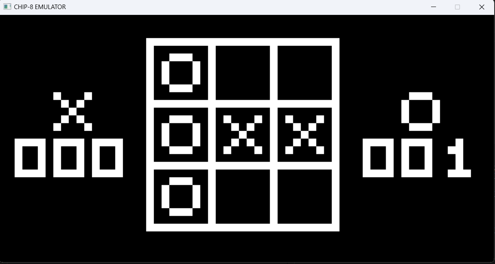
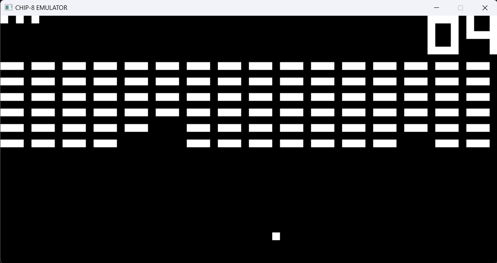
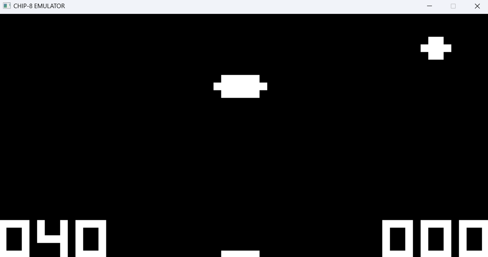

# chip8-emulator-rust
Chip 8 emulator using Rust :)

## How to run 
1. Clone repository
2. Get some chip 8 roms from - https://github.com/kripod/chip8-roms
3. `cd desktop`
4. `cargo run /path/to/rom`

### TIC TAC TOE

### BRIX

### UFO
 
